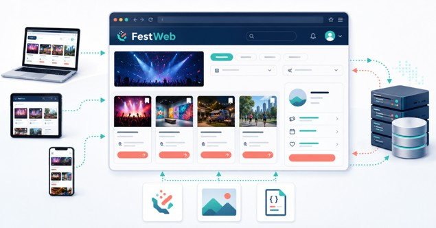

## 3.1. ¿Qué es una aplicación web?

Una aplicación web es un programa al que se accede normalmente mediante un navegador y que permite consultar información, introducir datos o realizar diferentes acciones. A diferencia de un programa tradicional, en la mayoría de los casos, no es necesario descargar e instalar manualmente la aplicación en el equipo. El usuario accede mediante una dirección web y el navegador descarga los recursos que necesita para mostrarla y permitir la interacción. 

Algunos ejemplos de aplicaciones web podrían ser:

* Una tienda en línea [Amazon](https://www.amazon.com)
* Una plataforma educativa [Aules](https://aules.edu.gva.es)
* Un servicio de correo electrónico [Outlook](https://outlook.office.com)
* Una aplicación bancaria [Ing](https://ingdirect.es)
* Un sistema de reservar [AirBnb](https://www.airbnb.es/)
* Una red social [Facebook](https://facebook.es)
* Una herramienta colaborativa [Jira](https://www.atlassian.com/es/software/jira)
* Un portal de gestión de eventos como FestWeb [Cronorunner](https://www.cronorunner.com)

Una aplicación web suele presentar las siguientes características:

* Se accede mediante una dirección o URL.
* Utiliza el navegador como entorno de ejecución.
* Puede comunicarse con uno o varios servidores.
* Permite interactuar con información o servicios.
* Puede actualizar su contenido sin reinstalar el programa.
* Puede utilizarse desde dispositivos y sistemas operativos diferentes.
* Suele almacenar información de forma local o remota.

## 3.2. FestWeb

**FestWeb** será una aplicación web dedicada a la publicación y consulta de eventos. Una persona usuaria podrá, por ejemplo:

1.	Consultar los eventos disponibles
2.	Filtrar los eventos por categoría o fecha
3.	Acceder a la información detallada de un evento.
4.	Registrarse o iniciar sesión
5.	Inscribirse en un evento
6.	Consultar sus inscripciones.

## 3.3. Página web, sitio web y aplicación web.

En el lenguaje cotidiano se utilizan frecuentemente como sinónimos los términos página web, sitio web y aplicación web. Sin embargo, no representan exactamente lo mismo:

* **Página web:** es un documento individual al que se puede acceder mediante una dirección concreta. Puede contener desde textos, imágenes, vídeos o elementos interactivos.
* **Sitio web:** Un sitio web es un conjunto organizado de páginas y recursos relacionados que comparten un mismo dominio y finalidad común. Puede contener, por ejemplo, en FestWeb, una página de inicio, listado de eventos, detalle de un evento o información de contacto. Cada una es una página diferente, pero todas forman parte del mismo sitio web
* **Aplicación web:** Es un sitio web en el que la interacción y el procesamiento de información tienen un peso importante. No se limita a proporcionar y que el usuario lea información, sino que puede realizar acciones como buscar, filtrar, introducir datos, realizar una compra… FestWeb se considera una aplicación web porque no se limitará a publicar información sobre eventos. Permitirá buscar, filtrar, registrarse, inscribirse y gestionar información.

| Concepto { .table-main-column .table-content .table-bg-principal .table-cl-secundario }  | Descripción { .table-full-container .table-content .table-bg-principal .table-cl-secundario } | Ejemplo en FestWeb { .table-full-container .table-content .table-bg-principal .table-cl-secundario } |
|---|---|---|
| Página Web { .table-main-column .table-content .table-bg-principal .table-cl-secundario }  | Documento individual | Detalle de un evento |
| Sitio Web { .table-main-column .table-content .table-bg-principal .table-cl-secundario }  | Conjunto de página relacionadas | Todo el portal entero |
| Aplicación Web { .table-main-column .table-content .table-bg-principal .table-cl-secundario }  | Sitio con interacción y procesamiento | Búsqueda, acceso e inscripción |

> Pregunta
> 
> ¿Un periódico digital es un sitio web o una aplicación web? ¿Cambiaría la respuesta si permite iniciar sesión, personalizar las noticias, guardar artículos y publicar contenidos?

## 3.4. Aplicaciones web estáticas y dinámicas

Las aplicaciones y páginas web también pueden clasificarse según la forma en que generan y actualizan su contenido. 

* Un contenido es **estático** cuando se entrega al navegador prácticamente tal como se encuentra almacenado en el servidor. Si varias personas solicitan el mismo recurso, normalmente reciben el mismo contenido. Por ejemplo: una página de presentación o la información de contacto. Qué una página sea estática no significa que no pueda tener estilos, animaciones o algún comportamiento sencillo. Significa que su contenido principal no se genera específicamente para cada petición o usuario. 
* Un contenido es **dinámico** cuando puede generarse, modificarse o actualizarse según determinados datos o circunstancias. Por ejemplo, el contenido puede depender de la persona que ha iniciado sesión, la información almacenada en una base de datos, los parámetros de búsqueda o las acciones realizadas por el usuario.

!!! actividad-opcional "Actividad opcional"
    Clasificad como estáticas o dinámicas estas partes de FestWeb:

    * Aviso legal
    * Listado de eventos
    * Perfil personal
    * Logotipo
    * Historial de inscripciones
    * Política de privacidad.

No debemos pensar que toda una aplicación es necesariamente estática o dinámica. La clasificación también puede aplicarse a partes concretas de la aplicación.

!!! actividad-opcional "Actividad opcional"
    Escribe dos ejemplos de contenido estático y dos ejemplos de contenido dinámico que podría aparecer en FestWeb. Justifica brevemente cada respuesta

## 3.5. Aplicaciones web y aplicaciones de escritorio

Una **aplicación de escritorio** es un programa diseñado para ejecutarse directamente sobre un sistema operativo. Generalmente debe instalarse en el dispositivo antes de utilizarse. Una **aplicación web**, en cambio, se utiliza normalmente desde un navegador y obtiene parte de sus recursos mediante una conexión de red. 

| Aspecto { .table-main-column .table-content .table-bg-principal .table-cl-secundario }  | Aplicación Web { .table-full-container .table-content .table-bg-principal .table-cl-secundario } | Aplicación de escritorio { .table-full-container .table-content .table-bg-principal .table-cl-secundario } |
|---|---|---|
| Acceso | Mediante navegador y URL | Mediante un programa instalado |
| Instalación | Generalmente no requiere instalación manual | Normalmente debe instalarse |
| Actualización | Puede realizarse en el servidor | Puede requerir actualizar el programa |
| Compatibilidad | Puede funcionar en distintos sistemas | Puede depender del sistema operativo | 
| Conexión | Suele necesitar conexión, al menos inicialmente | Puede funcionar completamente sin conexión |
| Acceso al dispositivo | Limitado y controlado por el navegador | Generalmente más amplio |
| Distribución | Centralizada a través de la Web | Mediante instaladores o tiendas |
| Código | Parte se descarga al navegador | Se encuentra instalado en el equipo |

Las fronteras entre ambos modelos son cada vez menos rígidas. Algunas aplicaciones web pueden instalarse, funcionar parcialmente sin conexión o acceder de forma controlada a determinadas capacidades del dispositivo. También existen aplicaciones de escritorio construidas con tecnologías web.

> **Ventajas habituales de las aplicaciones web:**
>
> * Acceso desde dispositivos diferentes
> * Distribución sencilla mediante URL
> * Actualización centralizada
> * Menor dependencia del sistema operativo
> * Facilidad para compartir y colaborar
> * Integración con servicios disponibles en Internet
>
> **Desventajas habituales de las aplicaciones web:**
> 
> * Dependencia total o parcial de la conexión
> * Restricciones de seguridad del navegador
> * Diferencias entre navegadores y dispositivos
> * Menor acceso directo al sistema operativo
> * Rendimiento condicionado por el dispositivo y la aplicación
> * Necesidad de proteger las comunicaciones y datos.

!!! actividad-opcional "Actividad Opcional"
    Responde a las siguientes preguntas:

    1. ¿Qué caracteriza a una aplicación web?
    2. ¿En qué se diferencia una página, un sitio y una aplicación web?
    3. ¿Qué significa que un contenido sea dinámico?
    4. ¿Puede una aplicación combinar contenido estático y dinámico?
    5. ¿Qué diferencias generales existen enter una aplicación web y una aplicación de escritorio?
    6. ¿Por qué FestWeb se considera una aplicación Web?

{ .imagen-centrada }