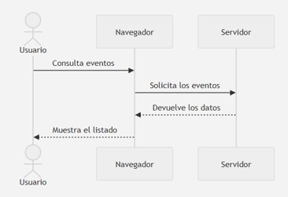

Una aplicación web no se ejecuta completamente en un único lugar. Su funcionamiento depende de la colaboración entre diferentes componentes conectados mediante una red. Por ejemplo, cuando una persona accede a FestWeb, el navegador solicita los recursos necesarios, los recibe, los proceso y muestra la interfaz. Más adelante, cuando consulta eventos o realiza una inscripción, puede ser necesario enviar nuevas peticiones al servidor.

Comprender este recorrido permite identificar:

* Qué elementos forman una aplicación web
* Dónde se encuentra la información 
* Qué tareas realiza el navegador
* Qué operaciones necesitan un servidor
* Cómo viajan las peticiones y las respuestas.
* Qué recursos recibe y procesa el cliente.

## 4.1. El modelo cliente - servidor

La mayoría de las aplicaciones web utilizan una arquitectura denominada cliente-servidor. En ella, diferentes programas se reparten las tareas necesarias para proporcionar un servicio:

* El cliente es el programa o dispositivo que solicita un recurso o servicio. En una aplicación web, suele ser el navegador. Este, permite al usuario introducir una dirección, solicitar recursos, interpretar los archivos recibidos y mostrar la interfaz con la que puede interactuar.
* El servidor es el sistema que recibe las peticiones de los clientes y proporciona los recursos o servicios solicitados. Puede encargarse de tareas como entregar los archivos HTML, CSS o JavaScript; buscar información en una base de datos o comprobar las credenciales de una persona.

La relación entre cliente y servidor sigue generalmente esta secuencia:

{ .imagen-centrada }

## 4.2. Elementos de una aplicación web

Aunque inicialmente hablamos de cliente y servidor, una aplicación web real suele estar formada por más elementos:

* **Usuario:** Es la persona que utiliza la aplicación y origina las interacciones
* **Dispositivo:** Es el equipo desde el que se accede a la aplicación.
* **Navegador:** Es el programa que actúa como cliente web.
* **Red:** La red permite la comunicación entre el cliente y el servidor.
* **Servidor Web:** Recibe peticiones y entrega recursos.
* **Aplicación del servidor:** Es el software encargado de procesar las operaciones que no se realizan en el navegador
* **Base de datos:** Almacena de forma organizada la información persistente de la aplicación
* **Servicios externos:** Una aplicación puede utilizar servicios proporcionados por terceros.

!!! actividad-opcional "Actividad opcional"
    Relaciona cada uno de los siguientes conceptos con el elemento de una aplicación web al que están relacionados:

    * Tableta.
    * Introduce una dirección.
    * Tabla de información de usuarios registrados.
    * Tabla de información de lugares y fechas.
    * Pulsa un botón.
    * Solicita los recursos.
    * Tabla de información de eventos y categorías.
    * Ejecuta JavaScript.
    * Realiza una búsqueda.
    * Gestiona usuarios.
    * Ordenador.
    * Aplica reglas de negocio.
    * Comprueba los datos recibidos.
    * Servicio de pagos.
    * Interpreta HTML y CSS.
    * Servicio de envío de correos.
    * Servicio de mapas.
    * Teléfono móvil.
    * Internet

> **Pregunta**
>
>  Si FestWeb muestra la previsión meteorológica de una carrera, ¿necesita almacenar necesariamente esa información en su propia base de datos o podría solicitarla a otro servicio?

## 4.3. Peticiones y respuestas

La comunicación entre el servidor y el cliente se organiza mediante **peticiones** y **respuestas**. Una petición es un mensaje que el cliente envía para solicitar un recurso o pedir que se realice una operación. Esta puede servir para, entre otras cosas, obtener una página, descargar una imagen o cargar una hoja de estilos. Por contrapartida, una respuesta es el mensaje que el servidor devuelve después de procesar la petición. Esta puede contener desde un documento HTML a código JavaScript

{ .imagen-centrada }

Cuando se visita una dirección web, el navegador no suele recibir toda la información mediante una única respuesta. Primero puede solicitar un documento HTML, analizarlo y descubrir que necesita otros recursos. Por lo tanto, cargar una sola página puede originar decenas o cientos de peticiones.

!!! actividad-opcional "Actividad opcional"
    Abre el navegador que utilices habitualmente, selecciona las herramientas de desarrollo, abre la pestaña de red y accede a la [página](www.amazon.es).

    Verifica cuantas peticiones se realizan hasta que la página se muestre completamente.

Originalmente, las aplicaciones web solicitaban frecuentemente un documento completo cada vez que el usuario realizaba una acción. Las aplicaciones actuales pueden también solicitar únicamente los datos que necesitan y actualizar una parte de la interfaz sin recargar todo el documento. Esta capacidad será fundamental en el estudio de la comunicación asíncrona y el consumo de servicios web.

### 4.4. La dirección URL

Una URL (*Uniform Resource Locator*) es la dirección que permite localizar un recurso disponible en una red. Cuando escribimos una URL en el navegador, indicamos qué recurso queremos solicitar y dónde puede encontrarse.

!!! ejemplo "Ejemplo"
    `https://www.google.com/translate`

Una URL puede contener las siguientes partes:

| Parte { .table-main-column .table-bg-principal .table-cl-secundario } | Ejemplo { .table-main-column .table-bg-principal .table-cl-secundario } | Función { .table-full-container .table-bg-principal .table-cl-secundario } |
|---|---|---|
| Protocolo | `https` | Indica cómo se realizará la comunicación |
| Dominio | `festweb.es` | Identifica el servidor o servicio |
| Puerto | `443` | Identifica el punto de comunicación; normalmente se omite |
| Ruta | `/eventos/42` | Localiza un recurso o funcionalidad |
| Parámetros | `?vista=completa` | Proporcionan información adicional |
| Fragmento | `#inscripcion` | Señala una parte del recurso mostrado |

!!! actividad "Actividad opcional"
    Analiza las diferentes partes de esta URL:

    `https://festweb.es/eventos?categoria=musica&orden=fecha#resultados`

### 4.5. Recursos solicitados por el navegador

Un recurso web es cualquier elemento que puede localizarse y solicitarse mediante una dirección. Para construir una interfaz, el navegador puede necesitar:

- **Documentos HTML:** definen la estructura y el contenido inicial.
- **Hojas de estilo CSS:** determinan la presentación visual.
- **Archivos JavaScript:** incorporan comportamiento e interactividad.
- **Imágenes e iconos:** muestran carteles, fotografías, logotipos o elementos gráficos.
- **Fuentes:** permiten utilizar familias tipográficas diferentes de las instaladas en el dispositivo.
- **Contenido multimedia:** audio, vídeo, animaciones o documentos descargables.
- **Datos:** información que no se presenta directamente como una página completa; por ejemplo, los datos sin procesar de un evento.
- **Recursos propios y externos:** pueden proceder del mismo servidor o de servidores externos, como un servicio de mapas.

### 4.6. Recorrido completo de una petición web

Cuando una persona introduce una dirección y accede a una aplicación web, se produce esta secuencia:

1. **El usuario introduce una URL.** Escribe una dirección o selecciona un enlace.
2. **El navegador localiza el servidor.** Determina qué sistema proporciona el servicio asociado al dominio.
3. **Se establece la comunicación.** El navegador inicia la comunicación con el servidor.
4. **El navegador envía una petición.**
5. **El servidor procesa la petición.**
6. **El servidor devuelve una respuesta.** Contiene el recurso, los datos solicitados o información sobre el resultado, junto con un código que indica si la operación ha sido correcta.
7. **El navegador procesa el HTML.**
8. **Se solicitan los recursos adicionales.** Hojas de estilo, archivos JavaScript, imágenes y demás elementos necesarios.
9. **Se construye la representación visual.**
10. **La aplicación queda preparada para la interacción.**

!!! actividad "Actividad opcional"
    Organiza estos pasos en el orden correcto:

    - El listado visible se actualiza.
    - El servidor devuelve los datos.
    - El navegador recibe el HTML.
    - El servidor consulta la información.
    - La persona aplica un filtro.
    - El navegador genera las tarjetas de los eventos.
    - La aplicación solicita los eventos disponibles.
    - La aplicación solicita o selecciona los resultados correspondientes.
    - El navegador construye la interfaz.
    - Descubre y descarga los estilos y el código JavaScript.
    - El navegador solicita el documento inicial.
    - La persona introduce la dirección de FestWeb.

!!! actividad "Actividad opcional"
    Responde a las siguientes preguntas:

    1. ¿Qué función desempeña el cliente en una aplicación web?
    2. ¿Qué tareas puede realizar el servidor?
    3. ¿Por qué el navegador no debe conectarse directamente a la base de datos?
    4. ¿Qué diferencia existe entre una petición y una respuesta?
    5. ¿Por qué cargar una página puede producir varias peticiones?
    6. ¿Qué partes principales puede contener una URL?
    7. ¿Qué tipos de recursos descarga el navegador?
    8. ¿Qué recorrido se produce desde que introducimos una URL hasta que aparece la interfaz?
    9. ¿Puede una aplicación realizar nuevas peticiones sin recargar toda la página?
    10. ¿Cómo se aplican estos conceptos al funcionamiento de FestWeb?

!!! salto-pagina-pdf ""
